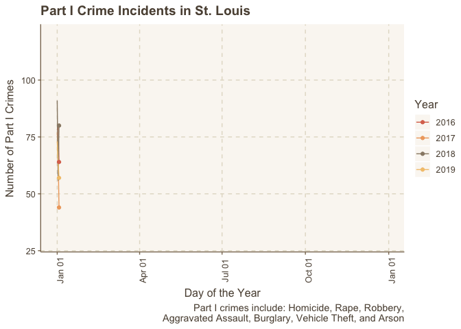
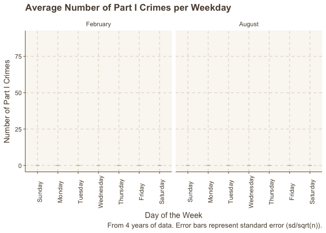
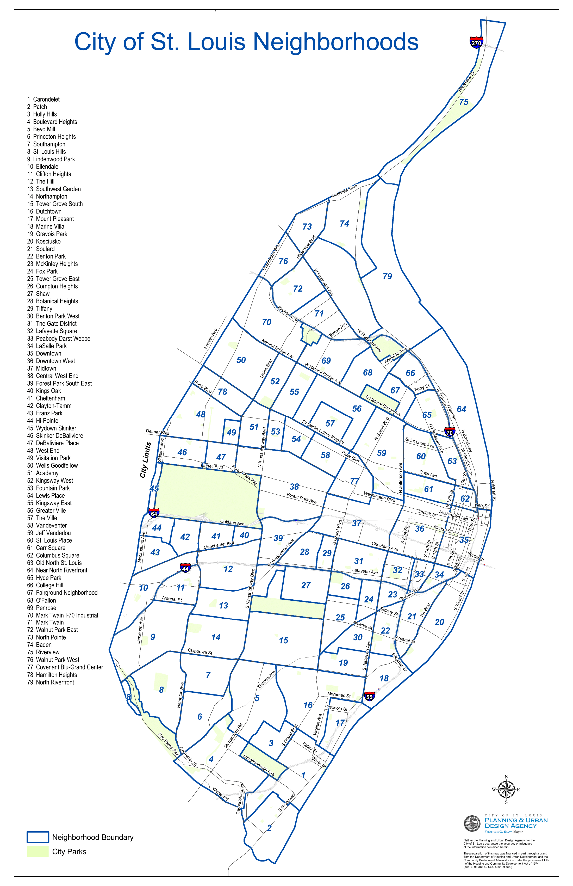

```{r setup, include=FALSE}
knitr::opts_chunk$set(echo = TRUE)

```


# Introduction
As explained elsewhere in my portfolio, I recently moved to St. Louis, Missouri for grad school. Knowing that there are reports saying that St. Louis has the highest crime rate in the United States (depending on the year - see [FBI Stats](https://ucr.fbi.gov/crime-in-the-u.s/2017/crime-in-the-u.s.-2017/tables/table-8/table-8.xls/view) and [Wikipedia](https://en.wikipedia.org/wiki/List_of_United_States_cities_by_crime_rate#References)), a lot of my friends and family have expressed concern about me living here - especially when I told them that I take public transportation every day. I've been in St. Louis for about 7 months now, and so far so good, but should I be worried? 

With those thoughts in mind, this analysis looks at [St. Louis Metropolitan Police Department data](http://www.slmpd.org/Crimereports.shtml) to learn more about **when and where crimes take place in St. Louis.** Like I said, I have felt fairly safe here so far, but can this data reveal places I should avoid, and when to avoid them? There are a lot of factors related to crime that won't necessarily be addressed here, in part due to limits in the data I have and limits in the amount of free, spare-time that I have, but hopefully this is enough to convince my friends that I won't literally die trying to get a PhD - my death will only be figurative..

You can optionally view the code used to do this analysis by clicking on the 'Code' buttons on the right side of the screen.

***

*Warning* - This analysis includes crime data, including some mention of rape statistics, which may be uncomfortable for some readers.

***

# Load Libraries and Import Data
First, we'll need to load the libraries we'll be using and then import our data.
```{r message=FALSE, warning=FALSE}
# Load libraries that we'll be doing
library(ggplot2) # For plotting
library(gganimate) # For plotting
library(ggthemr) # For plotting
library(tidyr) # For formatting data
library(dplyr) # For formatting data
library(scales) # For plotting
library(lubridate) # For handling dates
library(gridExtra) # For plotting multiple plots
library(ggmap) # For getting Google Maps data
library(rgdal) # For conversion of map coordinates
library(png) # For displaying images
library(grid) # For displaying images
```


```{r echo=FALSE, message=FALSE, warning=FALSE}
# Set up some things the user doesn't need to see
setwd("~/Desktop/Data-Science-Portfolio/Projects/STLCrime")
ggthemr("dust") # Current theme for all plots. Consider changing
```


```{r}
### DATA IMPORT
# Import data, subset some columns, and create a few helper columns
# Months available
months <- c("January", "February", "March",
            "April", "May", "June",
            "July", "August", "September",
            "October", "November", "December")

# Years available
years <- c("2016", "2017", "2018", "2019")

# Columns of interest that appear in each dataset
cols <- c("Complaint", "CodedMonth", "DateOccur", "FlagCrime",
          "Count", "Crime", "District", "ILEADSAddress",
          "ILEADSStreet", "LocationName", "LocationComment",
          "Neighborhood", "XCoord", "YCoord")
dat <- NULL

# Iteratively load each data file, and merge into a single data.frame
for (year in years) {
  for (month in months) {
    # Path to data file
    filename <- paste0("Datasets/", month, year, ".csv")
    file_data <- read.csv(filename)
    
    # Some datasets include periods in their column names. Remove them
    names(file_data) <- gsub("\\.", "", names(file_data))
    
    # Subset to the columns of potential interest that are common to all datasets
    file_data <- subset(file_data, select = cols)
    
    # Combine datasets into a single data.frame
    if (is.null(dat)) dat <- file_data
    else dat <- rbind(dat, file_data)
  }
}
# Add a leading 0 to crime codes that got truncated
dat$Crime <- formatC(dat$Crime, width=6, format="d", flag="0")

# Remove reports that are not coded as actual crimes
dat <- subset(dat, dat$Count == 1)

# Set a flag for crimes that are considered "Class I" crimes and "Class II" crimes
dat$ClassI <- ifelse(as.numeric(substr(dat$Crime, start = 1, stop = 2)) < 9, 1, 0)
dat$ClassII <- ifelse(dat$ClassI == 1, 0, 1)

# Split up info from the date/time of the event
dat$Date <- substr(dat$DateOccur, start = 1, stop = 10)
dat$Date <- gsub("/", "-", dat$Date)
dat$Time <- substr(dat$DateOccur, start = 12, stop = 16)
dat$DateObj <- as.Date(dat$Date, format = "%m-%d-%Y") 
dat # Take a peek at our data.frame
```

Above is a preview of the loaded data that we'll be analyzing to answer our questions. To limit the scope of our questions slightly, **I've chosen to only look at crimes that are considered "Part I" crimes, ie. homicide, rape, robbery,aggravated assault, burglary, vehicle theft, and arson.**

***

# When are crimes committed?
There are a few ways to address this question. What time of day are crimes committed? What time of year? Which day of the week? It's also important to note that the information about when a crime occurred is imperfect. Clearly, if people knew exactly when crimes were happening, those crimes might not have happened in the first place. The St. Louis Police Department website explains that the date and time reported for a crime are approximate estimates - for example, if a person leaves town for a week and finds that their house has been robbed, it might not be clear exactly when the crime happened. 

***

## Annual Crime Rates
With those limits to our data acknowledged, let's begin at a large scale - how do crime rates change over the year? To answer this, let's plot the number of crimes that occurred each day over the year for our 4 years of data.
```{r message = FALSE, warning = FALSE, results = FALSE}
# Group together crimes that happened on the same day,
# count the number of Part I crimes that happened each day
grouped <- dat %>%
  group_by(DateObj) %>%
  summarise(ClassICount = sum(ClassI))

# Remove crimes committed before our timeframe
grouped <- subset(grouped, grouped$DateObj > "2015-12-31")

# Extract year info, so they can be colored differently,
# and modify formats so data can be plotted together over a single year,
# rather than in separate years
grouped$Year <- as.factor(substr(grouped$DateObj, start=1, stop=4))
grouped$SameYearDateObj <- format(grouped$DateObj, format="%m-%d")
grouped$SameYearDateObj <- as.Date(grouped$SameYearDateObj, format = "%m-%d")

# Plot the data
p <- ggplot(grouped, aes(x=SameYearDateObj, y=ClassICount, group=Year, color=Year)) +
  geom_line() +
  scale_x_date(date_labels = "%b %d") +
  labs(title="Part I Crime Incidents in St. Louis",
       x = "Day of the Year",
       y = "Number of Part I Crimes",
       caption = "Part I crimes include: Homicide, Rape, Robbery,\nAggravated Assault, Burglary, Vehicle Theft, and Arson") +
  theme(axis.text.x = element_text(angle = 90)) +
  geom_point() +
  transition_reveal(SameYearDateObj)

# Animate the plot. Pause before looping again. Save it as a gif
anim_save("plot1.gif", animation = animate(p, end_pause = 30))
```
```{r echo=FALSE, fig.width=10}

```


It appears that **~20-30 more crimes happen per day over the summer than during the winter, and this pattern is consistent over the years.** It also appears that late February and early March may be the safest time of year. It isn't clear what causes these trends - it's likely a combination of weather, hours of daylight, trends in summer tourism, and dozens of other factors. In any case, it appears that it would be worth it to take extra precautions during the summer in St. Louis. Good to know!

***

## Crime Rates by Weekday
Now that we've shown that crime rates vary throughout the year - are there certain days of the week when crime is more common? Since we've just seen that crime varies over the year, I've cut our data down to just February and August (months with either low and high crime rates), and averaged the number of crimes seen per weekday in those months over the past four years.

```{r message=FALSE, warning=FALSE}
# Determine the day of the week based on the date
grouped$Weekday <- weekdays(grouped$DateObj)

# Extract the month data from the date
grouped$Mo <- months(grouped$DateObj)

# Subset down to just February and August - the apparent months with the lowest and highest crime rates
groupedFebAug <- subset(grouped, grouped$Mo == "February" | grouped$Mo == "August")

# Reformat data for plotting
dayCrime <- groupedFebAug %>%
   group_by(Weekday, Mo) %>%
   add_tally() %>%
   summarise(avg = mean(ClassICount), Sample = mean(n), se = sd(ClassICount) / sqrt(Sample))
dayCrime$Weekday <- factor(dayCrime$Weekday, 
                           levels = c("Sunday", "Monday", "Tuesday",
                                      "Wednesday", "Thursday", "Friday", "Saturday"))
dayCrime$Mo <- factor(dayCrime$Mo, levels = c("February", "August"))

# For adding some animation to the plot
dayCrimeTransition <- rbind(dayCrime, dayCrime)
dayCrimeTransition$State <- c(rep(1, 14), rep(2,14))
dayCrimeTransition$avg <- ifelse(dayCrimeTransition$State == 1, 0, dayCrimeTransition$avg)
dayCrimeTransition$se <- ifelse(dayCrimeTransition$State == 1, 0, dayCrimeTransition$se)

# Create plot
p2 <- ggplot(dayCrimeTransition, aes(x=Weekday, y=avg, fill=Weekday)) +
  geom_col() +
  facet_wrap(~Mo) +
  theme(legend.position = "none") +
  geom_errorbar(aes(ymin=avg-se, ymax=avg+se, color="black"),
                width=.2,                    # Width of the error bars
                position=position_dodge(.9)) +
  scale_color_manual(values=c("gray")) +
  theme(axis.text.x = element_text(angle = 90)) +
  labs(x="Day of the Week", y="Number of Part I Crimes",
       title="Average Number of Part I Crimes per Weekday",
       caption="From 4 years of data. Error bars represent standard error (sd/sqrt(n)).") +
  transition_states(
    State,
    transition_length = 2,
    state_length = 1,
    wrap = F
  )

# Animate the plot. Pause before looping again. Save it as a gif that doesn't loop
anim_save("plot2.gif", animation = animate(p2, renderer = gifski_renderer(loop = F)))
```
```{r echo=FALSE, fig.width=10}

```

First, these plots re-affirm what we saw previously, showing a **drastic increase in the average number of crimes per day in August compared to February.** Though we do see some variation in the number of crimes committed, it's **hard to make any strong claims from this**, considering 1) some dates for crime occurrences are just estimates and 2) many of the days are within the standard error of most other days. It's also interesting that Tuesday seems to have one of the lower number of crimes in February, but the highest number of crimes in August. There are likely some underlying factors here (weather, which day of the week holidays fall on, which day of the week sporting events/other events fall on during these years), but it seems fair to conclude that while there may be subtle differences in the number of crimes per weekday, the differences are so minute that it probably doesn't warrant any change in the precautions taken by people in St. Louis or in policing efforts by the SLMPD - and certainly not at the scale we saw when looking at annual data.

***

## Crime Rate by Time of Day
Finally, **do crimes tend to occurr at certain times of day?** Since time of day is the smallest measurement in our dataset, and many of the times recorded are just estimates of when the crime may have been committed - we will need to be extra careful about drawing any strong conclusions from this, but still, it seems worth looking at. Here, I've used total counts over the four years, rather than averages like I used above. I have also rounded all times to the nearest hour for easier visualization. In the interest of getting as much info out of this plot as possible, I've color coded the crimes to also see if certain types of crimes tend to happen more commonly at certain times of day.

```{r message=FALSE, warning=FALSE, fig.width=10}
# Subset down to only Part I crimes
datSubset <- subset(dat, dat$ClassI == 1)

# Round all times to the nearest half hour
datSubset$Time <- strftime(lubridate::round_date(as.POSIXct(datSubset$Time, format = '%H:%M'),
                                                 "1 hour"), format="%I:%M %p")

# Convert times to an ordered factor
datSubset$Time <- factor(datSubset$Time, levels = c("12:00 AM", "01:00 AM", "02:00 AM",
                                                      "03:00 AM", "04:00 AM", "05:00 AM",
                                                      "06:00 AM", "07:00 AM", "08:00 AM",
                                                      "09:00 AM", "10:00 AM", "11:00 AM",
                                                      "12:00 PM", "01:00 PM", "02:00 PM",
                                                      "03:00 PM", "04:00 PM", "05:00 PM",
                                                      "06:00 PM", "07:00 PM", "08:00 PM",
                                                      "09:00 PM", "10:00 PM", "11:00 PM"))
# Remove missing values
datSubset <- subset(datSubset, !is.na(datSubset$Time))

# Add labels to crimes based on crime codes, for visualization
datSubset$Category <- substring(datSubset$Crime, 0, 2)
categories <- c("Homicide", "Rape", "Robbery", "Aggravated Assault",
                              "Burglary", "Larceny", "Vehicle Theft", "Arson")
datSubset$Category <- categories[as.numeric(datSubset$Category)]
datSubset$Category <- factor(datSubset$Category, levels = categories)

# Plot the data
ggplot(datSubset, aes(x=Time, fill=Category)) +
  geom_bar() +
  theme(axis.text.x = element_text(angle = 90)) +
  labs(x = "Time of Day",
       y = "Number of Part I Crimes",
       title = "Time of Day that Part I Crimes are Committed",
       caption = "4 years of data. Rounded to the nearest hour.",
       fill = "Crime Type") 
```

It appears that **crimes committed in the early morning hours are drastically less common than crimes committed in the evening.** I also suspect that the large spike in crime at noon is related to the inaccuracies in crime reporting, and that noon is simply a default that many officers use when recording crimes that happened at an unknown time. It also seems **clear that some crimes are more likely to happen at certain times of day** - for example, it seems that virtually no homicides happened between 4-7am in the last 4 years, while rape is by far most common around midnight. Vehicle theft and arson seem much more common in the middle of the night as well, while larceny actually seems to be most common around 5-6pm. This is also our first visualization at how common different types of crime are, suggesting that **larceny is by far the most common crime, followed by aggravated assault, burglary, and vehicle theft.** The frequency of different specific types of crime isn't necessarily a central part of this project, but it will be visited again to some degree below.

Now that we've shown that there are both annual patterns and daily patterns in crime rates, let's make one final plot to verify something - do the daily patterns vary throughout the year? The above plot was hourly data over 4 years compiled together, but we've shown that crime varies drastically throughout the year in a predictable way. Does the time of day for crimes fluctuate throughout the year? For example, since it gets darker and colder at night in the winter, do we see a lower proportion of crimes at night in December than we do in July? With this type of graph, straight horizontal lines would mean no change, but if there are changes as we move from left to right, that means that the time of day that crimes occur changes throughout the year.

```{r fig.width=10}
datSubset$Month <- months(datSubset$DateObj)
datTime <- datSubset
# Group data to see the number of crimes at different times, throughout each month
monthlyTimes <- datTime %>%
  group_by(Month,  Time) %>%
  summarise(Total = sum(ClassI))
# Group data to see the total number of crimes each month, for percentage calculations
monthly <- datTime %>%
  group_by(Month) %>%
  summarise(MonthTotal = sum(ClassI))
# Calculate the percent of monthly crimes that happened at different times of day
monthTotals <- rep(monthly$MonthTotal, each=24)
monthlyTimes$MonthTotals <- monthTotals
monthlyTimes$Percent <- monthlyTimes$Total / monthlyTimes$MonthTotals
# For clearer visualisation, group times into 3 hour blocks
# The names of the time blocks are somewhat arbitrary
times <- as.character(monthlyTimes$Time)
times[times %in% c("12:00 AM", "01:00 AM", "02:00 AM")] <- "12 AM - 3 AM"
times[times %in% c("03:00 AM", "04:00 AM", "05:00 AM")] <- "3 AM - 6 AM"
times[times %in% c("06:00 AM", "07:00 AM", "08:00 AM")] <- "6 AM - 9 AM"
times[times %in% c("09:00 AM", "10:00 AM", "11:00 AM")] <- "9 AM - 12 PM"
times[times %in% c("12:00 PM", "01:00 PM", "02:00 PM")] <- "12 PM - 3 PM"
times[times %in% c("03:00 PM", "04:00 PM", "05:00 PM")] <- "3 PM - 6 PM"
times[times %in% c("06:00 PM", "07:00 PM", "08:00 PM")] <- "6 PM - 9 PM"
times[times %in% c("09:00 PM", "10:00 PM", "11:00 PM")] <- "9 PM - 12 AM"
times <- factor(times, levels = c("9 PM - 12 AM", "6 PM - 9 PM", "3 PM - 6 PM",
                                  "12 PM - 3 PM", "9 AM - 12 PM", "6 AM - 9 AM",
                                  "3 AM - 6 AM", "12 AM - 3 AM"))
monthlyTimes$GroupedTime <- times
monthlyTimes$Month <- rep(month.abb, each=24)
monthlyTimes$Month <- factor(monthlyTimes$Month, levels = month.abb)

# Plot the data
ggplot(monthlyTimes, aes(fill=GroupedTime, y=Percent, x=Month)) + 
  geom_bar(position="fill", stat="identity", width=1) +
  labs(x="Month", y="Percent of Monthly Crimes", fill = "Time of Day",
       title="Distribution of Crimes", 
       caption="4 years of data") +
  theme(axis.text.x = element_text(angle = 90))
```

It appears that **while there are predictable trends in crime rates both at the daily (mornings have least crimes) and annual level (February has least crimes), the time of day that crimes are committed doesn't change throughout the year very much**, and I suspect that if we had more data, the differences we see might disappear. We do seem to see a disproportionately high number of crimes in September mornings, but since that doesn't seem to be part of a trend, I suspect it is not overly meaningful, and may disappear if we had a larger sample size (though it is something to consider). This does however reinforce the data from the previous plot by clearly showing that **~50% of crime happens in the last 9 hours of the day, while only ~25% of crime happens in the first 9 hours.**

***

## Section Summary
To summarize so far, some of the things we've shown include:

1. Crime rates drop in late Winter and early Spring, and peak in the Summer each year
2. There does not appear to be specific day of the week that consistently has more or less crime
3. Crimes occur more frequently after 5pm, and are uncommon around 5am
4. Specific crimes are slightly more prevalent at certain times of day. 
5. Even though there are strong hourly and annual crime cycles, the proportion of crimes that
      happen each hour varies very little throughout the year.
6. 50% of crime happens in the last 9 hours of the day, while 25% happens in the first 9 hours
  
With that better understanding of when crimes are happening, it's time to move on to the second big question of this analysis - Where do crimes occur?

***

# Where do crimes occur?
What does the data tell us about where they are happening? Before we continue, it's important to remember that this data is all from the St. Louis Police Department. While they cover the St. Louis city limits, they don't cover all of what people might consider to be St. Louis. 

The dataset has several different types of location data, including Police District, neighborhood, street names, and NAD83 coordinates (similar to latitude/longitude), and some additional information as well. Since Police Districts aren't particularly meaningful geograph regions for most people, we'll avoid that for now and begin by simply looking at the neighborhood information.

***

## Crime Rates by Neighborhood
Let's begin by asking the question - can we observe a difference in the number of crimes that happen per neighborhood? If crime rates don't vary by region within the SLMPD data, then it will be difficult to dig very far into our question of where crimes happen.

```{r, fig.width=10}
# Subset down to only Part I crimes
datLoc <- subset(dat, dat$ClassI == 1)
# Extract year for visualization
datLoc$Year <- year(datLoc$DateObj)
# Subset down to only crimes committed in 2016 or later
datSub <- subset(datLoc, datLoc$Year >= 2016)
# Group neighborhoods together and count their total crimes per year
neighborhoods <- datSub %>%
  group_by(Neighborhood, Year) %>%
  summarise(Count = sum(ClassI))
neighborhoods$Year <- as.factor(neighborhoods$Year)
# Plot the data
ggplot(neighborhoods, aes(x=Count, fill=Year)) +
  geom_density(alpha=0.3) +
  labs(x="Number of Part I Crimes",
       y="Density",
       title="Distribution of Crimes by Neighborhood") +
  annotate("segment",
           x=500, y=0.0025,
           xend=250, yend=0.0025,
           arrow=arrow(), color="#5b4f41") +
  geom_text(x=750,y=0.0025, label="Most neighborhoods have\nless than 250 Part I crimes each year.",
            color="#5b4f41") +
  annotate("segment",
           x=1300, y=0.00085,
           xend=1500, yend=0.0001,
           arrow=arrow(), color="#5b4f41") +
  geom_text(x=1300,y=0.001, label="Some neighborhoods have\nover 1500 Part I crimes each year.",
            color="#5b4f41") +
  scale_x_continuous(breaks=c(0,250,500,750,1000,1250,1500,1750,2000))


  
```

It seems that **the vast majority of neighborhoods have about 200-250 Part I crimes each year, while several neighborhoods repeatedly have 5-6 times as many crimes.** It's important to note here that a few of the "neighborhoods" actually refer to parks or other locations, and that our dataset doesn't include population information. So it is possible that neighborhoods with more crime simply have more people. As a quick sanity check, a quick Google search tells me that the neighborhood here with one of the highest number of crimes ("Central West End") has a population of ~15,000 people. "Shaw", a neighborhood that averages ~200 crimes per year has a population of ~7,000 people, and the "neighborhoods" with the fewest crimes are all actually parks, which technically have a population of 0. **So while population is likely a factor, it seems that while the Central West End has only twice as many people as Shaw, it has about 7 times as much crime.** Even Forest Park, the largest park in the city, averages ~150 crime per year, with a population of 0.

For reference, and so **you can look up any neighborhood of interest**, I've output the Neighborhood ID's and their crime counts per year below. I've also included an image taken from [here](https://www.stlouis-mo.gov/government/departments/planning/documents/citywide-neighborhood-map.cfm) that shows how the St. Louis Police Department defines each neighborhood in their dataset (as well as the name of each neighborhood). **Though they vary in size, few seem to cover more than a couple square miles (the large green section on the left is Forest Park, which is ~3 miles long and ~1 mile wide). Knowing how small many of these neighborhoods are, it's amazing that some have ~1,500 Part I crimes each year (~4-5 crimes per day)!**

```{r echo=FALSE, fig.width=6}
neighborhoods
```


```{r echo=FALSE, fig.height=3, fig.width=2, message=FALSE, warning=FALSE}

```

***

## Crime Density Maps
Now that we now that some neighborhoods have way more crime than others, let's put together a visualization to better represent that information. These maps were pulled from the Google Maps API. The locations of various crimes are described based on the darkness of the gray/black over the map, and outlines of the 6 St. Louis Metropolitan Police Department districts were then laid over the plot to show where the jurisdiction of the SLMPD is (meaning we have no crime data from outside of these boundaries). It's also important to  remember that the densities are calculated for each crime seperately (a dark spot in the homicide plot may mean a different number of crimes than a dark spot in the vehicle theft plot, thought the proportion of crime should be similar).

```{r fig.width=10, fig.height=14, message=FALSE, warning=FALSE}
# The following gets a map from Google Maps. To reduce calls to their API during testing
# I've saved the map, commented out the code for calling their API, and just 
# loaded my local save of the map instead.
# Latitude/Longitude boundaries of our area of interest
#myLocation <- c(-90.4, 38.52, -90.15, 38.7) 
# Get a map of our area from Google Maps
#myMap <- get_map(location=myLocation,
#                 source="google",
#                 maptype="satellite",
#                 crop=F)
#saveRDS("STLouisMap.rds", myMap)
myMap <- readRDS("STLouisMap.rds")
# Subset our data down to crimes committed within our timeframe of interset (2016-2019)
sub <- subset(dat, year(dat$DateObj) > "2015")
# The following lines are for converting the location coordinates
# from Missouri NAD83 coordinates (used by SLMPD) to standard
# latitude and longitude coordinates
nad83_coords <- data.frame(x=sub$XCoord, y=sub$YCoord) # Get coordinates
nad83_coords$x <- nad83_coords$x * 0.3048 # Convert feet to meters
nad83_coords$y <- nad83_coords$y * 0.3048 # Convert feet to meters
coordinates(nad83_coords) <- c("x","y") # Label the coordinates
proj4string(nad83_coords)=CRS("+init=epsg:6512") # Original format was epsg:6512 (MO NAD83)
coords <- spTransform(nad83_coords,CRS("+init=epsg:4326")) # Convert to epsg:4326 (Lat/Lon)
coords <- data.frame(coords@coords) # Extract converted coordinates
names(coords) <- c("lon", "lat") # Name the converted coordinates
sub$Long <- coords$lon # Add the new coordinates to our data
sub$Lat <- coords$lat # Add the new coordinates to our data
sub <- subset(sub, sub$ClassI == 1) # Subset down to only Part I crimes
# Categorize our Part I crimes based on their crime codes
sub$Category <- substring(sub$Crime, 0, 2) 
categories <- c("Homicide", "Rape", "Robbery", "Aggravated Assault",
                "Burglary", "Larceny", "Vehicle Theft", "Arson")
sub$Category <- categories[as.numeric(sub$Category)]
sub$Category <- factor(sub$Category, levels = categories)
# Turns out that no location data was reported for rape,
# though it is unclear if that was intentional or by design.
subForPlot <- subset(sub, sub$Category != "Rape")

# Police District data from https://www.stlouis-mo.gov/data/datasets/distribution.cfm?id=70
# Add lines showing police districts to show what portions of the map our data could
# possibly be in
# Load shapefile downloaded from stlouis-mo.gov
shp <- readOGR("Datasets/mygeodata/GIS.STL.POLICE_DISTRICTS_2014.shp",
               stringsAsFactors = F, verbose = F)
# Extract coordinate information and convert from NAD83 to lat/lon, as was done above
a <- as.data.frame(shp@bbox)
nad83_coordsPD <- data.frame(x=a$min, y=a$max)
nad83_coordsPD$x <- nad83_coordsPD$x * .3048
nad83_coordsPD$y <- nad83_coordsPD$y * 0.3048
coordinates(nad83_coordsPD) <- c("x","y")
proj4string(nad83_coordsPD)=CRS("+init=epsg:6512")#epsg:6512, 3602
coordsPD <- spTransform(nad83_coordsPD,CRS("+init=epsg:4326"))
coordsPD <- data.frame(coordsPD@coords)
names(coordsPD) <- c("lon", "lat")
# Put the converted coordinates back into our shapefile object
shp@bbox <- as.matrix(coords)

# Create our plot
ggmap(myMap) + 
  # Color our plot based on density of crimes by location
  stat_density2d(
    aes(x = Long, y = Lat),
    size = 0.05, bins = 5, data = subForPlot,
    geom = "polygon", alpha=0.4
  ) +
  # Add on SLMPD District Locations, to show the range our data is limited to
  geom_polygon(data=shp, aes(x=long,y=lat,group=group),colour="black", fill=NA) +
  # Add labels
  labs(x="Longitude",y="Latitude",
       title="Locations of Crimes within SLMPD Boundaries",
       caption="Black lines show SLMPD district boundaries. Data from 2016-2019.") +
  # Divide up the plot by crime type
  facet_wrap(~Category)

```

There are some obvious and interesting trends here. **There are some definite crime hotspots!** Larceny (theft of personal property) seems to mainly be a problem in the East, and since the **densest place for larceny happens to be almost dead center on where the famous St. Louis Arch is**, it's possible that this may be a result of crimes happening to tourists and sight-seers. Crimes like homicide and burglary seem to have a large, dense spread in the North, and a smaller hotspot in the South - both in mostly residential areas. Meanwhile, vehicle theft seems pretty widespread through the entire region. No matter what crime you look at, **the South West of St. Louis seems quite safe (good news, I live in that direction!)**

***

## Section Summary
We've been able to get some important information regarding our question about where crimes happen, namely:

1. There are some neighborhoods that are hotspots for crime, with as many as ~4-5 crimes per day within a few city blocks
2. There are general hotspots for crime in the city, but some crimes occur more frequently in specific areas than others
3. The average neighborhood has ~200 crimes per year, or one crime every 1-2 days.
4. There do appear to be some neighborhoods that are significantly safer than average

***

# Conclusion
While not exhaustive, our analysis has provided some meaningful information to our initial questions of "When and where does crime happen in St. Louis?". We've determined that crime is most common in the evening and night during the summer, and that there are hotspots where extra caution should be taken. We've found that certain crimes happen more often at certain times of day and at certain locations. The data also suggests that, at least over the past 4 years, there is relatively little variability in these patterns - meaning that crime follows predictable patterns. I suspect that with enough additional information (weather, holiday and sporting events, population, income, etc.), we could create a quite accurate predictive model for estimating crime rates and locations. At the very least, that could help explain some of the trends we've described. Who knows, maybe that will be a future project?

***
